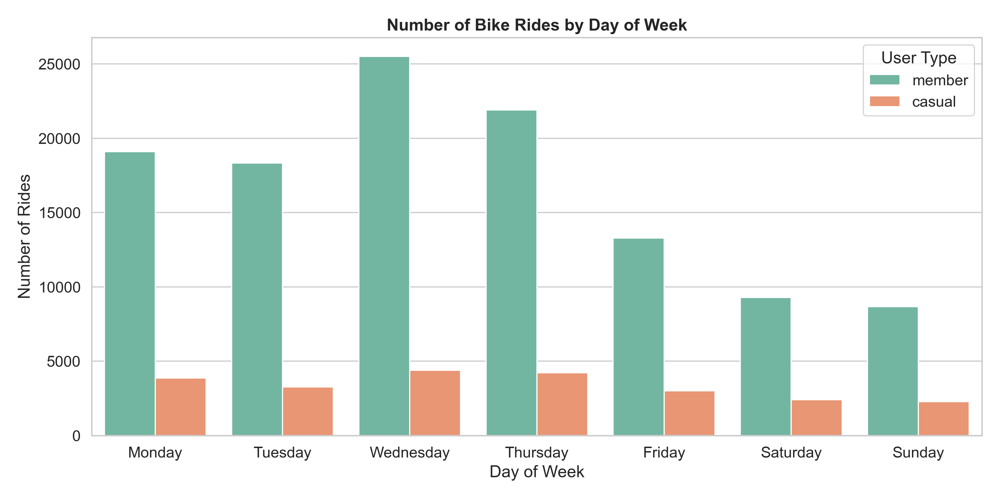

# 🚲 Cyclistic Bike-Share Analysis
## 📌 Project Overview
This project analyzes bike-share usage data from a fictional company called **Cyclistic**.  
The main goal is to understand how **casual riders** and **annual members** use bikes differently, and how these insights can help the business convert more casual riders into paid members.

This project was completed as part of my **Google Data Analytics Certificate**, using real-world data analysis practices.

---

## 🎯 Business Problem
Cyclistic’s marketing team wants to grow annual memberships.  
To do that, they need to understand:

- How casual riders behave compared to members
- On which days people use bikes the most
- Where marketing efforts could be most effective

---

## 👥 Stakeholders
- Marketing Director  
- Executive Leadership Team  

---

## 🛠 Tools & Technologies Used
- **Python**
- **Pandas** – data cleaning and analysis  
- **Seaborn & Matplotlib** – data visualization  
- **PyCharm** – development environment  
- **GitHub** – version control and portfolio hosting  

---

## 📂 Dataset Information
- Source: Public bike-share data (Divvy / Cyclistic)
- Time period: One full year of trip data
- Data includes:
  - Ride start time
  - Ride duration
  - Rider type (casual or member)
  - Day of the week

The dataset was cleaned to remove missing values, incorrect records, and extreme outliers.

---

## 🔍 Data Cleaning Process
Some of the key cleaning steps included:
- Converting date and time columns to proper datetime format
- Removing rides with negative or unrealistic durations
- Filtering out missing rider type information
- Standardizing weekday names for consistent analysis

---

## 📊 Key Visualization
The chart below shows how bike usage differs across the days of the week for casual riders and members.

---

## 💡 Key Insights
- Casual riders tend to use bikes more on **weekends**
- Members show more **consistent usage throughout the week**
- Weekday usage is higher for members, likely due to commuting
- Casual usage peaks on Saturday and Sunday

---

## ✅ Recommendations
Based on the analysis:
1. Promote **weekend membership offers** targeted at casual riders
2. Run **summer and weekend campaigns** when casual usage is highest
3. Highlight cost savings of membership for frequent weekend riders

---

## 📌 Conclusion
This analysis shows clear behavioral differences between casual riders and members.  
By focusing marketing efforts on high-usage days for casual riders, Cyclistic can increase the likelihood of converting them into annual members.

---

## 🙋 About Me
I am an **aspiring data analyst** with a strong interest in turning data into clear, actionable insights.  
This project reflects my ability to clean data, analyze trends, and communicate findings in a simple and effective way.

---

## 📬 Contact
Feel free to connect with me on GitHub or LinkedIn to discuss this project or data analytics opportunities.

Dhiraj Sharma

